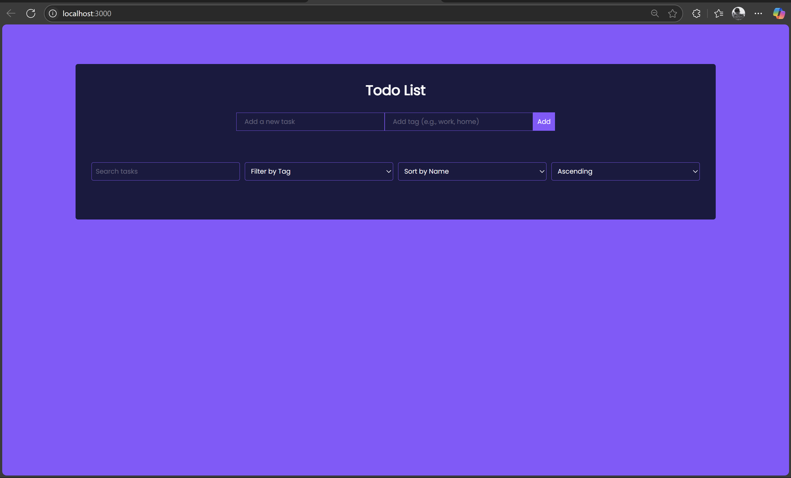
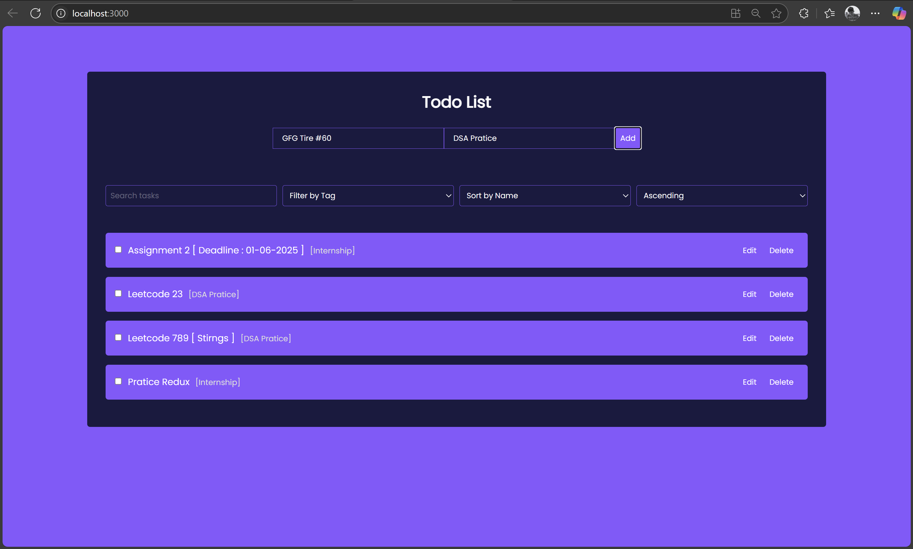
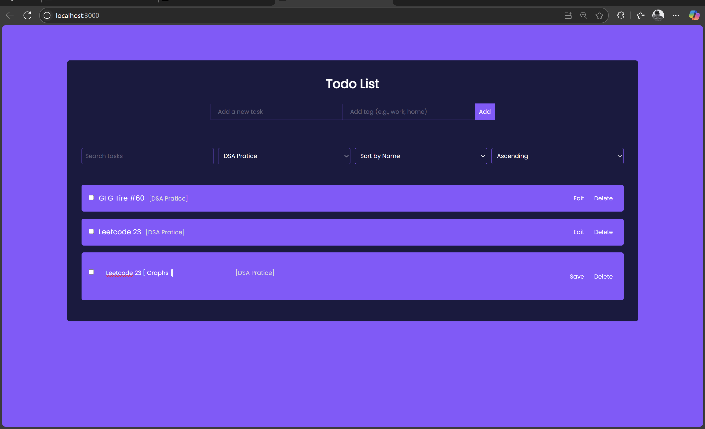
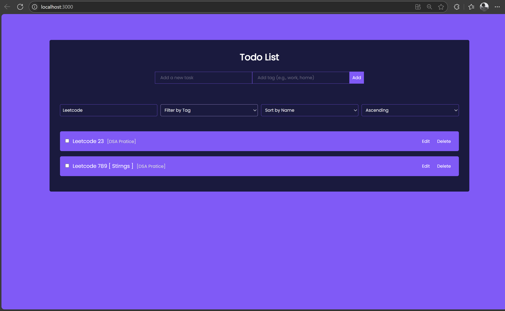
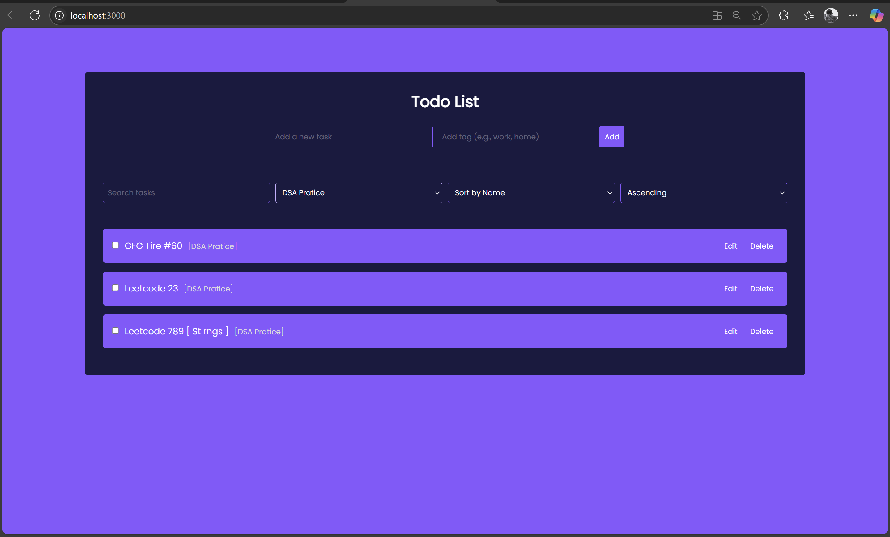

# 📝 React To-Do List App

A simple yet powerful React-based To-Do List application that allows users to:

- ✅ Add tasks with validation
- ✏️ Edit and update tasks
- ✔️ Mark tasks as completed
- ❌ Delete tasks
- 🔍 Filter/search by task text or tag
- ⬆️ Sort tasks (ascending)
- 💾 Persistent storage using `localStorage`

---

## 📸 Screenshots

### 🏠 Home Page



### ➕ Adding a Task



### ✏️ Edit a Task



### 🔍 Search Tasks



### 🏷️ Filter by Tag



---

## 🚀 Getting Started

### 1. Clone the repository

```bash
git https://github.com/karthikeyan1134/celebalTechnologiesAssignments/tree/main/assignment_2
cd your-repo-name
```

### 2. Install dependencies

```bash
npm install
```

### 3. Run the app

```bash
npm start
```

Visit [http://localhost:3000](http://localhost:3000) in your browser.

---

## ✅ Testing Guidance

| Feature              | Action                                   | Expected Result                           |
| -------------------- | ---------------------------------------- | ----------------------------------------- |
| **Add Task**         | Enter text and click **Add**             | Task is added to the list                 |
| **Input Validation** | Click **Add** without text               | Task is not added                         |
| **Mark Complete**    | Click task label                         | Text is struck through                    |
| **Edit Task**        | Click edit icon, change text, click save | Task updates with new content             |
| **Delete Task**      | Click trash/delete icon                  | Task is removed                           |
| **Search Tasks**     | Type in search field                     | Task list filters in real-time            |
| **Filter by Tag**    | Select tag from dropdown                 | Only matching tasks are shown             |
| **Sort Tasks**       | Select sort option (e.g., ascending)     | Tasks reorder accordingly                 |
| **Local Storage**    | Refresh the browser                      | Tasks remain (persisted via localStorage) |

---

## 🛠 Built With

- [React](https://reactjs.org/)
- [CSS3](https://developer.mozilla.org/en-US/docs/Web/CSS)

---

## 📂 Folder Structure

```
src/
├── components/
│   └── TodoApp.js
│   └── style.css
├── App.js
├── index.js
├── App.css
├── index.css
public/
├── screenshots/
│   ├── Home.png
│   ├── Adding_Task.png
│   ├── EditTask.png
│   ├── Search.png
│   └── FilterbyTag.png
```

---

## 👨‍💻 Author

**[Karthikeyan Akkpalli]**  
[karthikeyan1134](https://github.com/karthikeyan1134).
